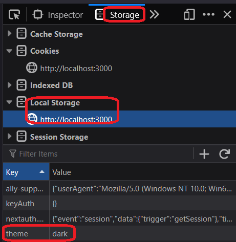
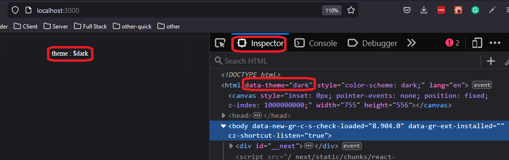

<h2>Motivation</h2>
Use also dark mode in my next.js

<h2>Installation</h2>
 It seems that next-themes is the way

 ```
 npm i next-themes
 ```

<h2>next-themes</h2>
<ul>
<li>This is the module that manages the theme</li>
<li>It persist the theme to local storage 

 </li>
</ul>

<h2>Code - _app.tsx</h2>

<p>The code is here so it will be common for pages</p>


```typescript
import { ThemeProvider } from "next-themes";

...

 <ThemeProvider>
      <Component {...pageProps} />
    </ThemeProvider>
```

<h2>Code - index.tsx</h2>
mounted is used due to hydration problem - check 'Avoid Hydration Mismatch' <a href='https://www.npmjs.com/package/next-themes'>here</a>

```typescript
export default function Home() {
  const [mounted, setMounted] = useState(false)
  const { theme, setTheme } = useTheme()

  useEffect(() => setMounted(true),[])

  if(!mounted){
    return null;
  }

  return (
    <>
      <main>
        <div className={styles.description}>
          <button onClick={() => setTheme('light')}>set light</button>
          <button onClick={() => setTheme('dark')}>set dark</button>
          <p>theme : ${theme}</p>
        </div>
      </main>
    </>
  )
}
```

 <h2>styling - globals.css</h2>

 ```css
:root {
  /* Your default theme */
  --background: white;
  --foreground: black;
}

[data-theme='dark'] {
  --background: black;
  --foreground: white;
}
 ```
<h2>Points of interest</h2>
<ul>
<li>data-theme in globals.css is actually an attribute of the html tag. You can verify this using the elements tab e.g. in chrome dev tools. Its value is light or dark (and system ??)



</li>
</ul>

<h2>Open issues</h2>
<ul>
<li>understand better the css</li>
<li>do i need mounted on every page</li>
</ul>
